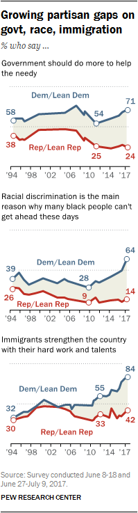

```{r setup, include=FALSE}
knitr::opts_chunk$set(echo = TRUE)
```

<style type="text/css">

body{ /* Normal  */
      font-size: 20px;
      font-family:'Avenir Next';
      background-color:white;
  }
  
</style>

# Polarization


```{r, echo=FALSE, fig.margin = TRUE, fig.fullwidth = TRUE, fig.cap="Growing Polarization. Source: Pew Research Center.", out.width = '85%'}
 
```

The United States is a polarized country. The views of Americans about key political questions---such as immigration, the role of government in addressing inequality, and racial discrimination---have come further 
apart in the last decade. Call this trend *belief and value polarization*. 

The main driver 
seems to be party membership. Americans are today more likely to view themselves as consistently liberal or consistently conservative than before. Call this trend *party polarization*. 

In addition---and most worryingly---members of the opposite political party are more likely to view the other side as a threat to the nation. Call this *affective polarization*.^[See Pew Research Center, [Political Polarization in the American Public](https://www.pewresearch.org/politics/2014/06/12/political-polarization-in-the-american-public/).]

Other distinctions could be made, but in general, polarization seems to consist 
in a growing division among people's attitudes: beliefs, values, party affiliation, how they view others, etc.^[Divisions, of course, do not just exist in attitudes, but also in material conditions: wealth, income, education, health, etc. Inequalities along these dimensions exist in the United States, and seem to be growing.]  This is a problem when it paralyzes political decision-making. 

# Explanations

A surface level explanation for polarization is that political parties, the media industry and Big Tech---those who influence people's attitudes---benefit from polarization. Big Tech is seeking consumers, the media industry an audience, and political parties voters. Perhaps, these objectives are most effectively achieved by sustained polarization.^[For a review of common explanations, see also Colbert, [How Politics Got So Polarized](https://www.newyorker.com/magazine/2022/01/03/how-politics-got-so-polarized), *The New Yorker*, 2021.] This explanation, plausible though it is, make us---those at the receiving end---an easily manipulable target. We are stripped away of our agency, independence of thought, freedom of choice. Are we really so powerless? If we are, why have we become like that?

Polarization might just be the tip of the iceberg of an ongoing crisis of Western democracies. We will focus on three deeper explanations. I have chosen them, not so much because there is overwhelming evidence in their favor, but because they are both plausible and provocative, commonsensical and radical, reasonable and unsettling. 

----------------

(a) `r tufte::newthought('Let')`'s start with **liberalism**. 

Perhaps, there is something wrong with "liberalism" itself, or with how it has been understood and implemented, 
or with some aspects of it that have come to dominate the United States (and other Western countries).
Liberalism is often used in the formula "liberal democracy", though liberalism and 
democracy are different concepts. There can be liberalism without democracy.

Democracy is a form of government guided in part by people's inputs, sometimes directly via referendum, or indirectly via elected representatives. In contrast, liberalism's core tenet is that the individual is the carrier of certain fundamental rights: the right to autonomy (belief, religion, speech, political association); the right to own private property and carry out economic activity; and, in liberal democracies, the right to vote.^[That the individual is the carrier of certain fundamental rights---or even that individuals exist---is a conceptual construction. We take it for granted as self-evident, but it is a recent idea. See, for example, Siedentop, *Inventing The Individual: The Origins of Western Liberalism*, Harvard University Press, 2014] 

Liberalism's primacy of the individual is associated with a weakening of 
people's ties towards the family, clans or local communities. When the severing 
of social ties is extreme, it brings about the atomization of society. At the same time, insistence on the primacy of the individual---especially, an insistence on individual property rights---has been historically accompanied by significant economic growth and rising standards of living.^[Standards of living, however, will primarily be understood on an individualistic level, say, in terms of individual wealth, income, purchasing power, access to consumer goods, etc.  Debates about morality, justice and fairness will also also tend to emphasize individuals.]

Since individuals form their own beliefs and preferences, and own their own property, great material and idealogical diversity will exist in a liberal society. There will be diversity of thought, but also material inequality. In this context, the primary goal of the government should be to foster this "diversity" without imposing a particular conception of the good. The choice of what counts as the good should be left up to individual choices. This is how the right to autonomy is realized in a liberal society.^[John Rawls, the most influential political philosopher of the 20th century in the United States, shares this view in the slogan "political not metaphysical". But he also believed that the basic structure of society should comply with justice as fairness. After all, no thinker in the liberal tradition would hold that individual choices should be entirely unconstrained.] 

These premises, according to political scientist Deneen, lead to the *degradation of citizenship*.

> The idolization of "diversity" in the form of personal identity was sewn into the deepest fabric of the liberal project, and with it the diminution of a common civic...the only allegiance that would remain was to a political project that supported ever more individuation.^[Deneen (2018), *Why Liberalism Failed*, p. 166]

> Yet once degraded, such as a citizenry would be unlikeliy to insist upon Tocquevillian self-command; its response would predictably take the form of inarticulate cries for a strongman to rein in the power of a distant and ungovernable state and market.^[Ibid, p. 178]

This is not an explanation for polarization. An emphasis on individualism should 
lead to fragmentation, not polarization. But it is an explanation for why we are powerless and manipulable. 
A manipulable populace can then be 
turned into a polarized crowd.^[For Deenen, liberalism's emphasis on the individual has many implications: 
freedom is reduced to choice; culture (understood as tie to place and time) disappaears; markets become globalized; local government recedes and the central state expands; etc.]

Deneen's analysis is far reaching. It reaches back 
to the founding fathers and the roots of modernity itself. 
Perhaps we need not reach so far back.^[A critique of liberalism, not as radical as Deneen's, is also offerred 
by Fukuyama, *Liberalism and Its Discontents*, 2022.]

----------------

(b) `r tufte::newthought('Let')`'s turn to the **free market**. 


According to intellectual historian Rodgers, the 1970s---in the middle of economic turmoil, rampant inflation, and rising unemployment---saw a radical shift in economic theory: the old distinction between macro- and micro-economics was replaced by a unified,  individual-focused approach:

> A graduate student in economics at Lucas's University of Chicago in the mid-1980s
put the point more baldly: "The macroeconomics [that we learn here] is very much like 
microeconomics. We look on individual levels and sum it up.^[Rodgers, *The Age of Fracture*, p. 67]

This shift in economic theory comes along with 
the popularization of a new conception of the free market: a self regulating network of "individual 
utility maximizers" that always produces efficient outcomes (in prices, allocation of goods and services, etc.) 
Rodgers emphasizes this is nothing other than a metaphor, but 
still, it is indicative of the spirit of the time. 

The individual becomes the sole unit of analysis. 
Social relations, common interests, larger structures, questions of power drop out.

> As the market grew more abstract, society thinned out into highly reduced microeconomic mental pictures:
Gilder's heroically independent enterpreneurs, Lucas's foward-looking utility maximizers, Wanniski's fish and conocnut traders...
To imagine the market now was to imagine a socially detached array of economic actors, free to choose and optmize, unconstrained by power and inequalitie, governed not by their common deliberative action but by the impersonal laws of the market.^[Ibid, p. 76]

So, while perhaps the atomization of society is not 
inherent in liberalism itself---as Deneen believes---it 
is visible in Rodgers' intellectual history 
of the 70s and 80s.


----------------

(c) `r tufte::newthought('Finally')`, consider **ingroup biases**.

Public spaces in the United States were abundant 
in the first half of the 20th century. They were instrumental 
to create a common American identity. They solidified 
the social fabric. Americans had great trust in government 
spending.^[Tax brackets in the United States were also extremely high for high-income earners, even 90%, 
in the first half of the 20th century. See, for example, the data in Piketty, *Capital in the Twenty-First Century*, 2013.] These attitudes are miles away from today's widespread 
anti-government sentiments. What has changed?

Bestselling author and policy advocate McGhee recounts how many cities in the South had 
beautiful public swimming pools and public parks.
During racial segregation, these facilities 
were only accessible to the white population.
In the 50s and 60s, federal courts mandated that public 
facilities be desegregated. But local administrators instead of 
complying with the orders ended up closing the facilities 
to everybody, white and black people alike.^[See McGhee, *The Sum of Us: What Racism Costs Everyone and How We Can Prosper Together*, 2021.]

That racism drained the pool---as McGhee poignantly put it---is consistent with 
the claim that welfare benefits are viewed more favorably in ethnically homogeneous 
societies such as Scandinavian countries, rather than ethically diverse 
societies such as the United States. Ethically diverse societies tend to have 
what is sometimes called "welfare chauvinism".^[There is empirical evidence that supports this view, though it is contested. See, for example, van der Meer and Reeskens, [Welfare Chauvinism in the Face of Ethnic Diversity](https://academic.oup.com/esr/article/37/1/89/5934740), *European Sociological Review* 37:1, 2021.]

In addition, McGheen's argues that Republicans in the 60s and 70s 
were aiming to cut taxes and reduce welfare benefits. 
But this political agenda could not have won support outright. So, in order to win the support of the white working class, Republicans played with their racial fears and racial resentment: undeserving black people could take away whites' gains if blacks were given access to public facilities and government benefits in the way whites had in the past.
The solution? Cut taxes and welfare benefits altogether. This political strategy worked in Republicans' favor, but also triggered a course of deepening identitarian divisions in the country.^[On the role of anger, resentment and identity politics, see Mason, *Uncivil Agreement: How Politics Became Our Identity*, 2018.]


# The Common Ground
 
 So why a course on the common ground? Seeking a common ground is sometimes touted as the solution to the problem of polarization, and the lack of a common ground as its cause, though some also disagree. Perhaps, the two sides 
 should not be treated symmetrically.^[Should we try to seek common ground with those 
 who deny vaccine effectiveness and scientific findings? See, for example, Nguyen, [Polarization or Propaganda?](https://www.bostonreview.net/articles/polarization-or-propaganda/), *Boston Review*, 2021.]  
  
 
 A common ground might or might not be the solution to polarization, 
 but there are preliminary questions 
 that need addressing here.  What is the common ground?  What role does it play? 
 Why is seeking one important?  What kind of common ground should we be seeking?
 
 The common ground---whatever it is, exactly---plays a role in making possible several 
 human cognitive endeavors: communication, reasoning, 
 rational inquiry, and---perhaps most importantly---political deliberation. Given its 
 multifaceted nature, this course examines the idea of the common ground from several sub-fields of philosophy: 
 language, logic, argumentation theory, epistemology, social and political philosophy.
 
 
 
 
 
